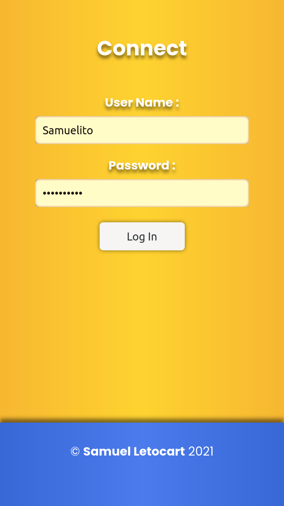
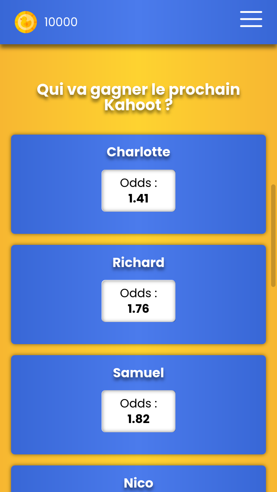
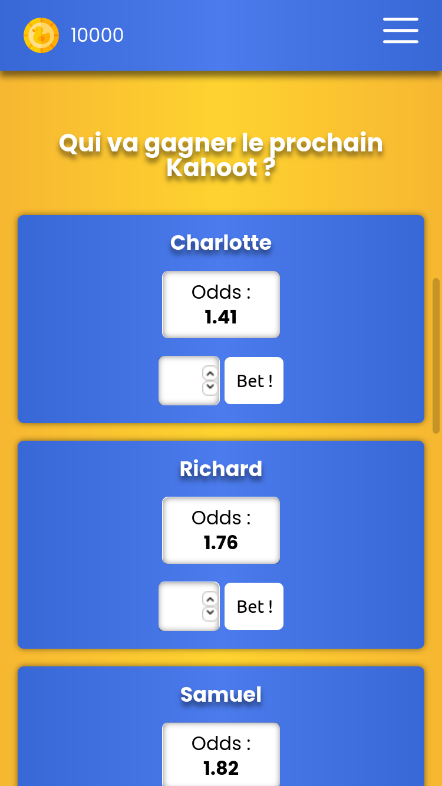
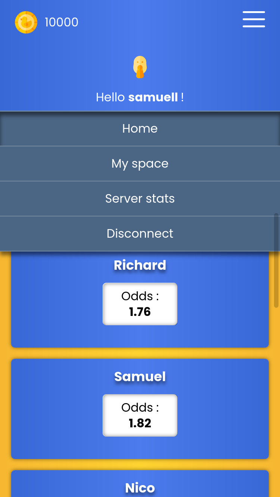
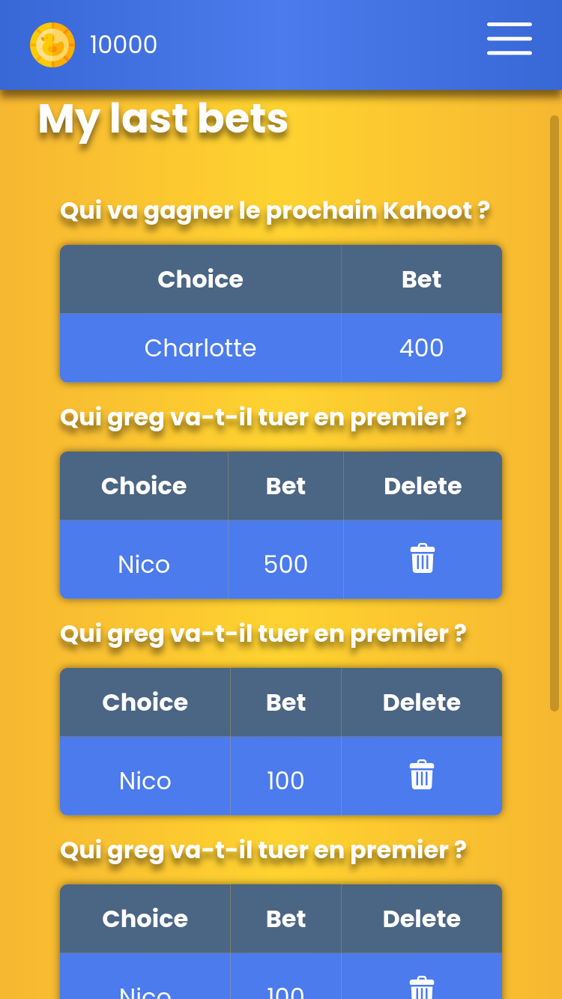
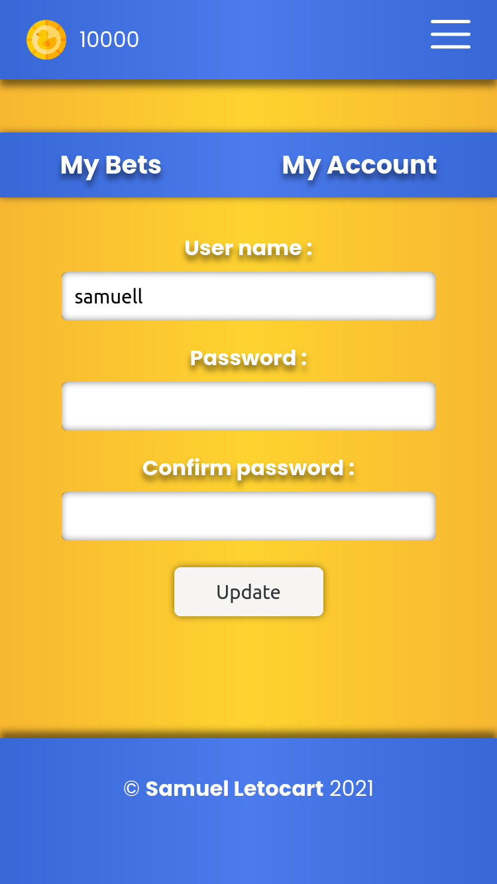
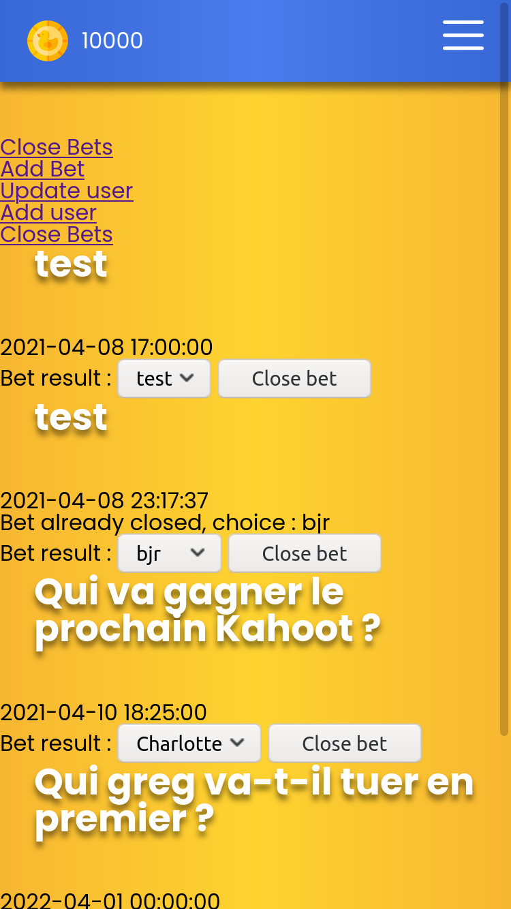
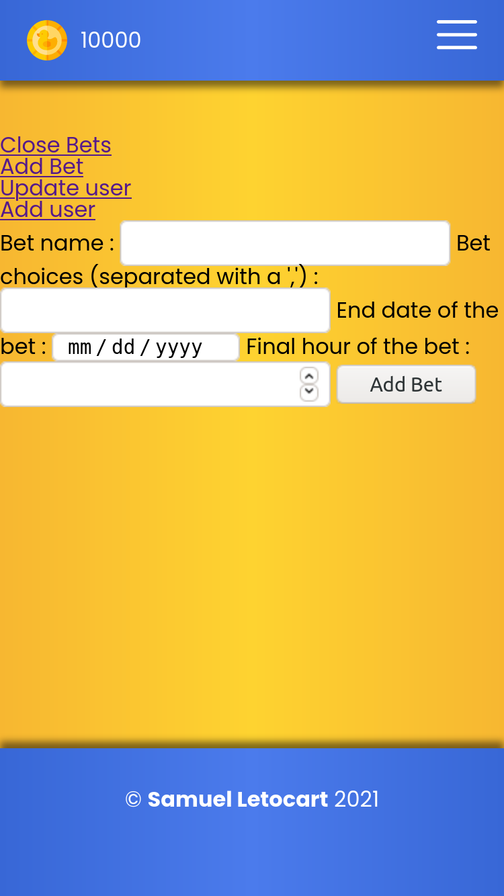
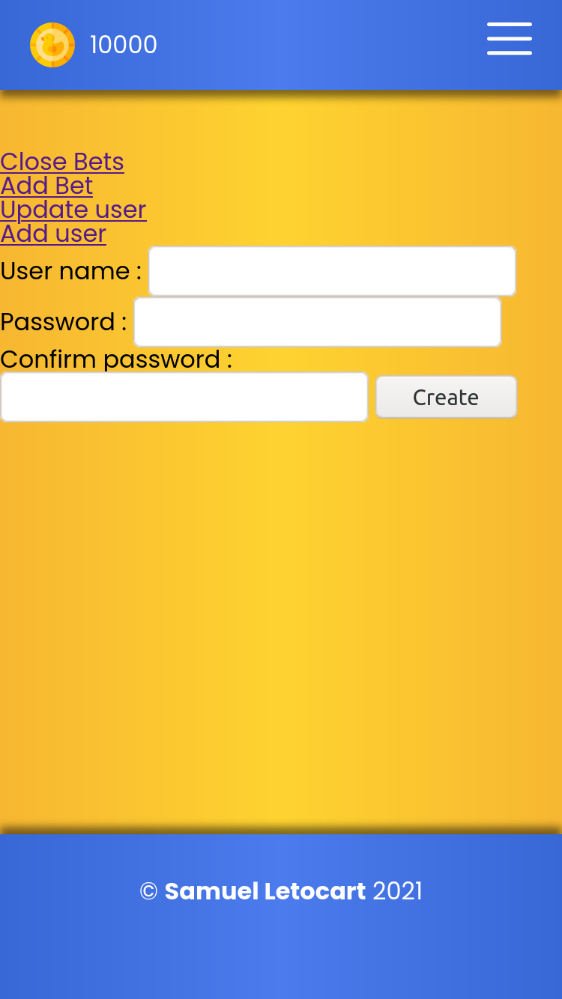

# CoinCoin's 
*Beware, betting CoinCoin's can cost you CoinCoin's*

## What is it about ?
Definitely not ducks... 🦆 CoinCoin's is a custom betting app I made during my spare time. The idea was to be able to gamble fake money (CoinCoin's) on random (and stupid/funny) bets with other students.
*Note that currently the project isn't totally finished (CSS to end plus security checks to do) nor is deployed on any platform.*

## Small Tech recap

I used an MVC architecture to build the app. You can access the app only of you're connected. The site is split in 2 main parts.

    1. The first part displays all the bets with the current odds.
    2. The second part allows the user to manage his account (His bets/His credentials)
    3. *A leaderboard of the players should be added*

There is an admin control interface to create/validate/delete bets.

## How does it work ?

*Note : all the screenshots have been done in mobile mode as the css is only done ofr this part*

### Landing

When you arrive on the site your only option is to connect to access the rest of the website.

### Home

When you log you access the main page. Here you can see all the bets. Each bet has multiple choices and each choice has an odd that is automatically computed when someone is placing a bid. In the menu you can access your personal access the rest of the app/logout or see the amount of remaining coins.

*Note : When a bet reach his final bid's deadline the users can't bet anymore*

### Personnal space

In his personnal space the user can change his pseudo/pass. *The pass is obviously hashed before save*

### Admin

*Note : No css has really been done for the admnin part*

- The admin can create new bets (the final date is the moment when the bids will be closed).
- He also can close a bet (the bids are first closed automatically when they reach their time limit THAN the admin close the bet by adding a final choice that will automatically send the coins to the users).
- He can add/modify users.

## Tech's summary

- Docker (for the dev environment) with :
    - MariaDB as database
    - PHP 8 & Apache
    - PHPmyAdmin (to manage database)

- Vanilla JavaScript
- SCSS

&copy; Samuel Letocart 2021